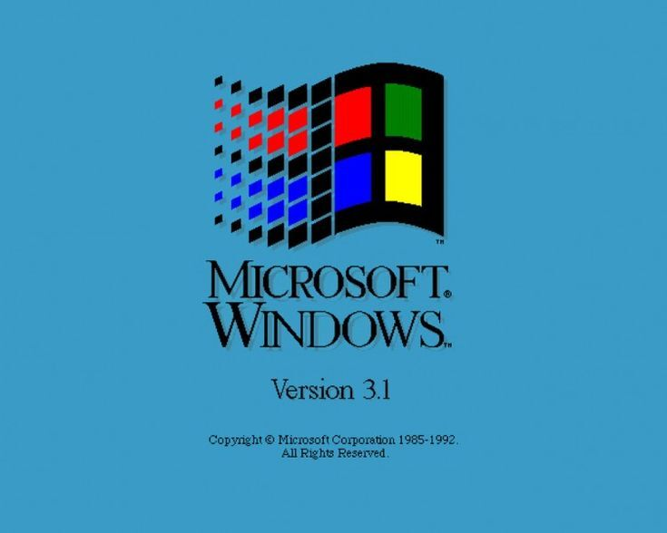

# 🖥️ AMIBIOS 6.22 – Retro DOS Machine in Your Browser

**A fully functional, browser-based MS-DOS 6.22 PC powered by the v86 emulator, wrapped in a nostalgic American Megatrends BIOS interface.**

[Live Demo](https://american-megatrends.vercel.app/) | [Report Bug](https://github.com/neelpatel112/american-megatrends) | [Request Feature](https://github.com/neelpatel112/american-megatrends)

---

---

## ✨ Features

- **Authentic BIOS Boot Screen** – Classic AMI BIOS POST display with hardware detection
- **Real MS-DOS 6.22 Environment** – Runs actual DOS commands, not just a simulation
- **Fully Interactive** – Type real commands like `DIR`, `COPY`, `EDIT`, `DEFRAG`, `SCANDISK`, and `FORMAT`
- **Keyboard Shortcuts**:
  - `DEL` → Enter BIOS Setup (simulated)
  - `F8` → Boot Menu
  - `Ctrl + Alt + Del` → Reboot the emulated machine
- **Persistent Disk Image** – ~2 MB floppy image loads once and caches for faster subsequent visits
- **No Installation Required** – Runs in any modern browser (Chrome, Firefox, Edge)
- **Retro Terminal Aesthetic** – Beige/grey CRT monitor styling with blinking cursor

---

## 🎯 What Works (100%)

| Command | Status | Notes |
|---------|--------|-------|
| `DIR` | ✅ | Lists directory contents |
| `COPY` | ✅ | Copies files |
| `DEL` / `ERASE` | ✅ | Deletes files |
| `REN` | ✅ | Renames files |
| `MD` / `RD` | ✅ | Create/remove directories |
| `TYPE` | ✅ | Displays text files |
| `EDIT` | ✅ | Full-screen text editor |
| `FORMAT` | ✅ | Formats virtual floppy/hard drives |
| `DEFRAG` | ✅ | Defragments drives |
| `SCANDISK` | ✅ | Scans and fixes disk errors |
| `MEM` | ✅ | Shows memory usage |
| `VER` | ✅ | Displays DOS version (6.22) |
| `CLS` | ✅ | Clears screen |
| Batch files (`.BAT`) | ✅ | Supports `ECHO`, `GOTO`, `IF`, `FOR`, `CHOICE` |

---

## 🛠️ Built With

- **[v86](https://github.com/copy/v86)** – x86 emulator written in JavaScript
- **MS-DOS 6.22** – Original Microsoft disk image (abandonware, for educational purposes)
- **HTML5 / CSS3** – Retro UI styling
- **JavaScript (ES6)** – Emulator integration and keyboard handling
- **Vercel** – Hosting and deployment

---
